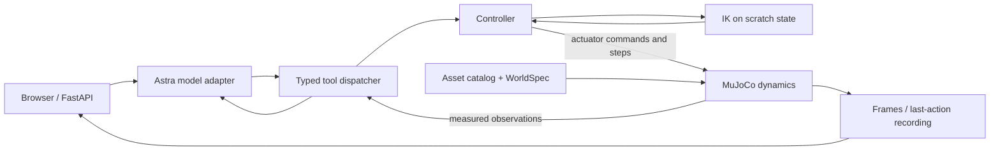
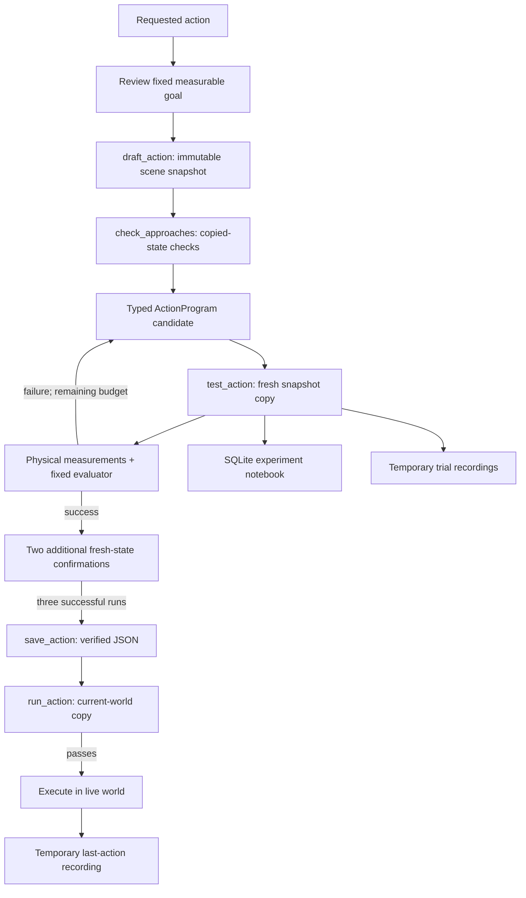

# Astra Robot World architecture

Open [`web/architecture.html`](../web/architecture.html) directly in a browser, or visit `/architecture.html` on the application server. The standalone canvas has selectable components, live and learning flows, and a searchable catalog of every top-level Astra tool with its exact parameter schema. It makes no model or simulation requests.

## Responsibilities

| Component | Responsibility | Source |
| --- | --- | --- |
| Browser and server | Present world frames, chat, goal review, experiment progress, notebook, and replays; coordinate requests and sessions | `web/`, `server.py` |
| Astra adapter | Send context and tool contracts to the configured OpenAI-compatible model; dispatch returned tool calls and return measured results | `astra.py` |
| Action proposal | Interpret a request into a reviewable, supported fixed goal before experiments start | `action_proposals.py` |
| Tool functions | Validate typed arguments and dispatch supported operations | `tools.py`, `session.py`, `general_session.py` |
| Scene and assets | Describe local assets; compile a `WorldSpec` into a MuJoCo model and initial data | `catalog.py`, `world_spec.py`, `world_builder.py`, `scene.py`, `assets/` |
| IK solver | Find bounded joint-angle solutions for a gripper position and orientation using scratch state | `motion.py` |
| Controllers | Check paths, command actuators, step physics, and enforce execution limits | `motion.py`, `action_motion.py` |
| MuJoCo | Compute physical dynamics, gravity, friction, contacts, poses, and velocities | `simulation.py` and controller stepping |
| Action Lab | Snapshot scenes, test candidates in isolation, evaluate outcomes, verify, save, and revalidate programs | `action_lab.py`, `action_contracts.py`, `circle_measure.py` |
| Notebook | Persist candidate programs, measured trials, failures, state transitions, and model notes | `action_notebook.py` |
| Rendering and recordings | Render current state or return frames recorded from isolated trials and live actions | `rendering.py`, `experiment_preview.py`, `server.py` |

Source filenames in this table are under `src/astra_world/` unless otherwise specified. The specialized sorting station remains a separate supported session path alongside general catalog worlds.

## Live execution



Astra selects functions and supplies data; it does not set arbitrary simulator state or execute arbitrary generated Python. The IK solver computes joint targets. The controller actuates the arm through MuJoCo. Actual dynamics determine the resulting movement and contact.

When a local IK search stalls, deterministic alternate seeds are mathematical starting guesses in scratch data. They do not teleport the live robot. A solver failure means its bounded search found no solution; it does not prove a pose impossible.

`check_approaches` is a bounded, read-only kinematic preflight on copied state: at most eight routes, each with at most eight absolute world-coordinate waypoints. It solves IK and samples joint interpolation for collisions. It does not consume physical trials, move the live scene, or prove that a grasp/contact action will succeed dynamically.

## Learning and reuse



Each draft captures scene specification, model, physics state, and revision. Every trial starts from a fresh copy of that captured snapshot. Experiments do not advance the live world. Failed candidates can be revised within the budget. A successful candidate automatically proceeds to two confirmation runs; all three successes are required before saving. Reusing a saved action validates bindings and scene compatibility and runs an isolated check against current state before live execution.

This is bounded search over typed motion programs, supported by persistent evidence. It does not train model weights or provide arbitrary reinforcement-learning goals.

### Program operations and limits

`ActionProgram.steps` contains one to 24 `MotionStep` values. The nested operations are `move_to_pose`, `gripper`, `contact_stroke`, `wait`, and `pick_place`. These are not five additional Astra tools. `pick_place` also exists independently as a top-level tool with a different argument schema.

Current action execution limits include 30 simulated seconds per program, a 40 N aggregate robot contact-load limit, joint limits, and collision checks. Draft trial budgets range from three to ten and include confirmations. Per model turn, the adapter allows at most 36 experiment/read-only calls and 12 live calls, followed by a tool-free summary. The experiment budget category includes notebook writes and saving actions, so it is not synonymous with read-only operations.

### Fixed measurable goals

| Goal | What is measured |
| --- | --- |
| `topple` | The target leaves its named lower support, reaches ground, and settles; the support may move |
| `displace` | The target center reaches the requested position within tolerance and settles; a particular path, grasp, or full containment is not verified |
| `circle` | Actual gripper motion traces the requested full circle within radial and plane tolerances |
| `extract` | A lower object moves out from under an upper object, which loses lower support and lands on the named landing body; both settle |

Extraction has three distinct entity roles: `object_id` is the lower extracted object, `supported_id` is the upper object, and `landing_id` is its destination support body. The lower must move at least `min_displacement` from its starting position and finish at least that far horizontally from the upper. An optional target also constrains the lower's destination. Direct manipulation of the upper is forbidden; its passive movement/drop is allowed. Unrelated objects, including the landing body, must be preserved. Extraction does not use `support_id`, and supporting contact does not establish full tray containment.

## Persistence and visual evidence

| Data | Location | Survives restart? |
| --- | --- | --- |
| Experiment goals, candidates, trials, failures, model notes | `actions/notebook.sqlite3` | Yes |
| Verified reusable programs and tested context | `actions/<name>.json` | Yes |
| Saved scene and physics state | `scenarios/` | Yes |
| Active drafts and working snapshots | Process memory | No |
| Trial and last-action replay frames | Bounded process memory | No |

The notebook distinguishes simulator measurements from model-written notes. Notes are hypotheses or interpretations and cannot override trial results or verification. Saved action files are reusable program artifacts; replay frames are a separate visual record.

`GET /experiments` lists trial recording metadata. `GET /action-replay` exposes last live-action recording metadata. `GET /frame.jpg?view=action` returns a recorded live-action frame. Playback reads frames; it does not execute the action again or rewind the current scene. A recording may include a failed or interrupted action; visible movement alone does not establish goal success.

## Updating the tool catalog

From the repository root, with project dependencies available:

```sh
python scripts/build_architecture.py
python scripts/build_architecture.py --check
```

The generator imports `astra.TOOLS` without constructing an adapter or loading provider configuration, then embeds names, descriptions, and full parameter schemas in the HTML. It also embeds each tool's actual turn-budget category from `EXPERIMENT_TOOLS`. The check compares the generated representation exactly, so changes to names, descriptions, schemas, or categories require a refresh. No external CDN, model call, credential, or browser network request is required to inspect the catalog.
