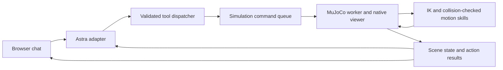

# Astra Robot World — hackathon design

Status: implemented locally. Three consecutive live Astra rehearsals and the native-viewer rebuild/action lifecycle have passed. See the implementation record at the end of the plan for the bounded choices made during development.

## Product

Type a request, watch Astra assemble a physical world, and ask its robot to complete a task. Change the world conversationally and watch the robot adapt.

The first demo runs locally on the user's MacBook Pro, Apple M4 Pro, 24 GB unified memory, 14-core CPU. Simulation and rendering run locally; Astra inference may use a remote service. The Astra endpoint, credentials, and actual model identifier must be established before live-model integration. Do not assume that a conversation model name is an API model ID.

## Accepted demo

1. “Build a sorting station with colored blocks and two bins.”
2. “Put the red blocks in the left bin.”
3. “Now add an obstacle between the robot and that bin.”
4. “Try again.”

Success means the first run sorts the red blocks with physical grasps; the obstacle appears in the previous transport corridor; the repeated trial uses a visibly different, collision-checked route and sorts those same blocks successfully. Non-red blocks remain outside the destination bin.

### Making “try again” meaningful

After a successful first run, the red blocks are already sorted. Simply repeating the goal would do nothing. Retain a snapshot from immediately before the sort. “Try again” restores the robot and movable blocks to that snapshot while retaining the newly added obstacle, then reruns the remembered goal. Show a clear status: “Resetting the blocks for another attempt; keeping the obstacle.”

This is an explicit demo trial action, not an invisible reset. If no previous task exists, report that there is nothing to retry. Reject restoration if a new obstacle overlaps a restored robot or block. Future product behavior could distinguish retrying a failed action from repeating a completed trial; the MVP uses the documented trial behavior above.

## Approach and alternatives

**Recommended:** native MuJoCo viewer plus a small local browser chat panel, a Python simulation worker, curated scene assets, and typed Astra tools. This keeps rendering and control native while leaving enough time for a usable prompt interface.

**Simpler fallback:** terminal chat plus native viewer. The same tools and simulation are exercised, with less UI work.

**Deferred:** streaming the rendered simulation into the browser. It offers a unified screen but adds encoding, transport, and macOS rendering work unrelated to the central demo.

## Scope

- One fixed Franka Panda arm, its gripper, a table, six blocks (two each red, blue, green), two open bins, and one configurable box obstacle.
- Scene requests compose a supported asset catalog into valid layouts; they do not invent arbitrary robot models or generate meshes.
- At least two validated layouts/seeds, configurable block colors/counts within a maximum of 12 blocks, and left/right bin targets demonstrate parameterized scene creation.
- Astra selects assets, resolves references, requests actions, and responds to tool outcomes. Python performs geometry, grasping, motion planning, control, and success checks.
- Ground-truth simulator state is the first observation channel. Vision-only control, training a policy, humanoid locomotion, and arbitrary furniture imports are outside the MVP.
- Transport normally uses a fixed lifted height; the demo obstacle blocks the original corridor so the second attempt visibly uses a side route rather than passing through it.
- Installing a robot model supplies mechanics, not a grasping or walking policy. Build and validate the Panda manipulation skills explicitly.

## Architecture

The simulation worker owns `MjModel`, `MjData`, and the viewer. Model requests run outside the physics loop. Start the worker using `mjpython` on macOS so passive-viewer rendering can use the required thread arrangement. Communicate through a bounded command queue; never mutate live simulation state from the HTTP or model thread. Allow one mutating action at a time; observation, status, and cancellation remain available.

### Scene builder

Use the installed Menagerie Panda model and procedural primitive props. Bins comprise a floor and four walls with collision geometry. Catalog records include dimensions, mass, friction, grasp frame, support surface, and source/license. Preserve the robot asset's license.

Scene requests produce a strict `SceneSpec`, with meters, radians, Z-up coordinates, and stable object IDs. “Left” means the bin labeled left in the fixed demo camera view; resolve it through a stable ID, not a guessed coordinate sign.

Compile a candidate scene separately, check placements and reachability, and settle it before replacing the running scene. Reject overlaps, objects outside the tabletop, inaccessible goals, and excessive object counts with specific tool errors. Adding an obstacle requires pausing and recompiling; transfer robot/object state by stable joint names, never raw array indices. Keep the old scene if compilation or validation fails. Increment `scene_revision` and invalidate previous trajectories.

### Motion and manipulation

Implement damped least-squares IK using MuJoCo kinematics/Jacobians and NumPy/SciPy. Start with a fixed downward gripper orientation and tested block dimensions compatible with the Panda gripper.

Execute approach → descend → close → verify grasp → lift → transport → lower → open → retreat. Move via actuator targets with stepped physics; do not teleport objects or weld them to the hand to fake a grasp.

For transport, try a small deterministic candidate set: direct, outer detour, inner detour. Solve each waypoint sequentially and sample joint-space segments on scratch simulation data. Check the whole arm, gripper, and held block against obstacles, table, bins, and other objects. During planned transport, update the held block's scratch pose from the measured grasp-relative transform; live execution still uses physical contact. Filter only intended contacts, such as the fingers touching the target during grasp. Return `no_path` when candidates fail; this is not a general-purpose global planner.

Check tracking error, grasp retention, unexpected contact, cancellation, and timeouts during execution. Replan against the latest scene revision; never execute a trajectory prepared for an older revision. `stop` holds the current joint targets and cancels queued actions; it is not a hardware emergency-stop claim.

### Astra tools and memory

Expose `list_assets`, `build_sorting_station`, `observe_world`, `sort_blocks`, `add_obstacle`, `retry_last_task`, and `stop`. These are typed application tools, not arbitrary Python execution.

Every result includes `ok`, `scene_revision`, and either a payload or an error code/detail. Store the last semantic sort goal and its pre-run snapshot separately from the chat transcript. Require explicit user intent for new scene mutations; do not let the model repeatedly reset a scene to conceal a failed grasp.

Observations include object IDs, colors, poses, bin membership, robot state, obstacle bounds, and last action outcome. Tool outcomes drive subsequent model decisions. An offline scripted adapter can verify plumbing, but the final demo must use live Astra calls and report actual simulation results.

### Interface

Browser panel: transcript, tool activity, action status, Run/Stop, and a brief asset list. Native viewer: fixed camera, labels or clearly colored bins, blocks, obstacle, and optional previous/current path overlays. Product messages describe actions and outcomes, e.g. “The obstacle blocks the previous route. Taking a path around its right side.” Keep detailed physics logs in developer output.

## Acceptance and validation

1. Import MuJoCo, load the real Panda asset, step physics, and render a frame on this Mac; record exact installed versions and commands.
2. Validate two scene seeds: no unintended initial contacts, bins within reach, correct counts/colors, stable settled objects.
3. Sort both red blocks into the left bin with physical gripper contact. A block counts as sorted only when its footprint is inside the bin interior and it remains there with low velocity for 0.5 simulated seconds.
4. Add an obstacle intersecting the recorded first transport corridor while avoiding restored object/robot poses. The previous route must fail collision validation.
5. Retry visibly resets the trial, preserves the obstacle and goal, computes a different valid route, and completes the sort.
6. An intentionally blocked layout returns `no_path`; invalid requests, unreachable placements, no prior retry task, and model/network failures produce honest, recoverable outcomes.
7. Stop interrupts a long action promptly (target: within 0.25 seconds wall time while the physics loop is healthy).
8. Complete the exact four-prompt sequence three consecutive times with a fixed seed before demo recording. Save tool logs and scene seed; do not use a scripted adapter for this final live-model check.

## Milestones and risk order

First prove physical pick-and-place, then obstacle routing and retry, then scene parameterization, then live Astra and presentation. The main uncertainty is manipulation reliability, not text parsing. If grasping fails, adjust gripper configuration, block geometry, contact parameters, or approach trajectories. Reduce scene variety before sacrificing the accepted demo's physical behavior.

## References

- MuJoCo Python and macOS viewer: https://mujoco.readthedocs.io/en/stable/python.html
- Procedural model editing: https://mujoco.readthedocs.io/en/stable/programming/modeledit.html
- Curated robot models: https://github.com/google-deepmind/mujoco_menagerie
- Optional later object expansion: https://robosuite.ai/docs/source/robosuite.models.objects.html
